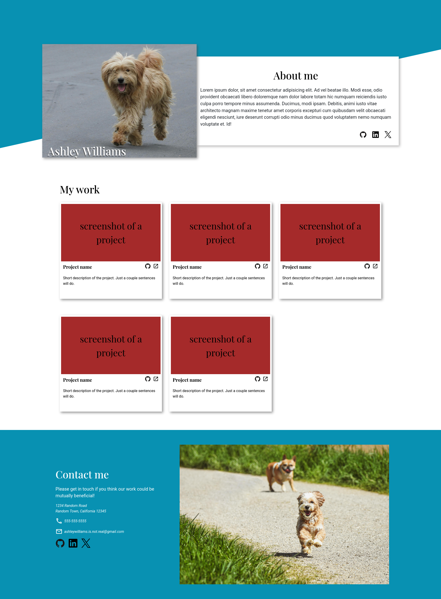

# Project: Homepage

## Screenshot

[Live Preview](https://matiasbastarrica.github.io/project-homepage-top/)

## Introduction

For this project, I'm going to create a responsive homepage, something I might find on a portfolio site of sorts. When you get to the point that you want to start sharing your work or applying for jobs, it’s useful to have a well-designed portfolio to share. While this one won’t be the definiteve one yet, I’ll practice with these more advanced HTML and CSS concepts first in order to take this as an opportunity to practice them!

I am tasked with building a given design brief. I have been provided a full design in 3 different sizes: desktop, tablet, and mobile. My job is to match each design as closely as possible for its respective viewport, and ensure that my layout looks good at any screen size between 320 and 1,920 pixels wide.

The main focus is on achieving the specified layouts and responsive behaviour rather than a complete portfolio.

## Assignment

**Step 1: Set up and planning**

1. Set up your HTML and CSS files with some dummy content, just to make sure you have everything linked correctly.

2. Download a full-resolution copy of the design files ([desktop design file](https://cdn.statically.io/gh/TheOdinProject/curriculum/fd6d4d2e2abbac4a3bd183bba6b6eaf1548a1458/advanced_html_css/responsive_design/project_personal_portfolio/imgs/portfolio.png), t[ablet design file](https://cdn.statically.io/gh/TheOdinProject/curriculum/ca8588077887c9b653898537e84b1346967a4f0b/advanced_html_css/responsive_design/project_personal_portfolio/imgs/portfolio%20tablet.png), [mobile design file](https://cdn.statically.io/gh/TheOdinProject/curriculum/1c8b5c739efd263e8cc48703988b18d6e3afe034/advanced_html_css/responsive-design/project_personal_portfolio/imgs/portfolio%20mobile.png)), and get a general idea for how you’re going to need to lay things out in your HTML document.

**Step 2: Gather assets**

1. The portraits we’ve used in the design files are stock photos downloaded from [pexels.com](https://www.pexels.com/). If you don’t have a picture of yourself handy, feel free to go grab a placeholder for now.

2. Select your fonts! We’re using `Playfair Display `and `Roboto` in the design, both available with Google fonts.

3. In the design, we have icon-links for GitHub, LinkedIn, and X (formerly known as Twitter). Obviously, feel free to add whatever links you want to your own site. We got those icons from [https://devicon.dev/](https://devicon.dev/).

4. Other icons (phone, email, and external link) were downloaded as SVGs from [https://materialdesignicons.com/](https://materialdesignicons.com/).
